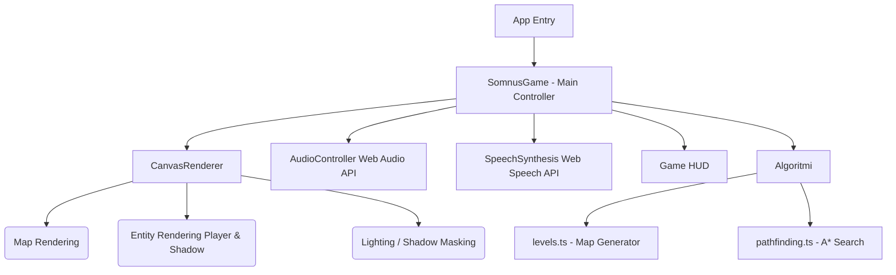
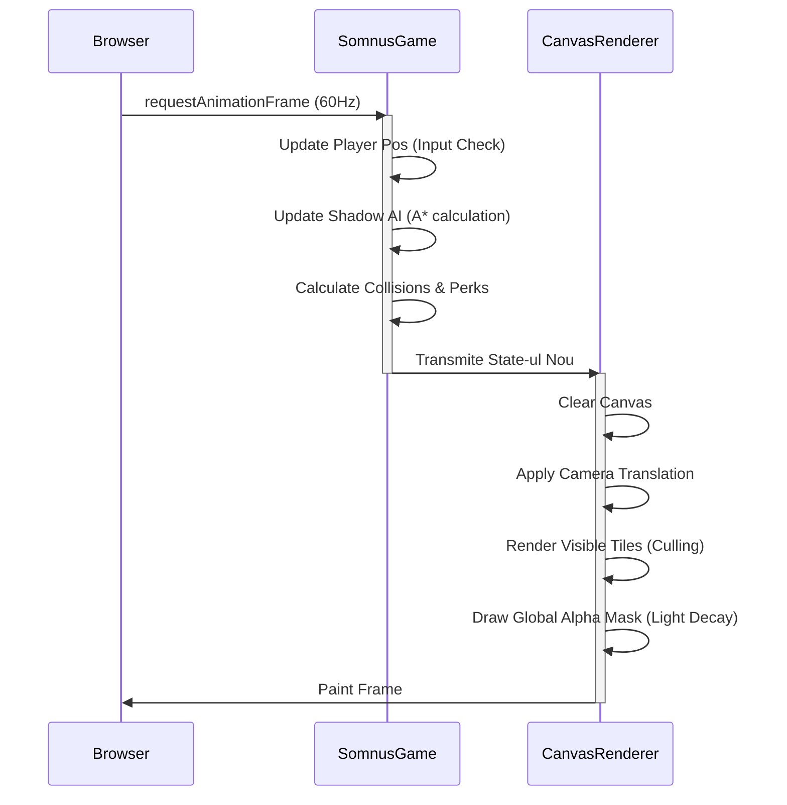

---
# UNIVERSITATEA / FACULTATEA (Completează aici)
# PROIECT DE LICENȚĂ

**Titlul Lucrării:** Somnus - Dezvoltarea unui joc video web-based de tip Horror-Supraviețuire cu medii generate procedural

**Coordonator Științific:** (Numele Coordonatorului)
**Absolvent:** Roberto
**Sesiunea:** 2026
---

# Cuprins
1. Introducere și Motivație
2. Arhitectura Aplicației (Diagrame UML)
3. Mecanici de Joc (Gameplay)
4. Algoritmii: Explicare Linie cu Linie
   4.1. Generarea Procedurală a Labirintelor (Recursive Backtracker)
   4.2. Navigarea Entității Antagoniste (A* Pathfinding)
5. Design Audio și Elemente de Imersiune
6. Concluzii și Direcții Viitoare

---

## 1. Introducere și Motivație

**Somnus** este un joc video de tip horror-supraviețuire dezvoltat exclusiv cu tehnologii web. Jocul plasează utilizatorul într-un mediu ostil, întunecat și claustrofobic, care se remodelează constant, forțându-l să se bazeze pe resurse vizuale minime (un câmp vizual restrictiv, asemenea unei lanterne care se stinge) și un sistem audio dinamic. 

Motivația principală din spatele acestui proiect este demonstrarea posibilității de a crea o experiență imersivă, capabilă să declanșeze stări psihologice de tensiune, exclusiv într-un browser modern, fără a necesita motoare grafice grele precum Unity sau Unreal Engine. Alegerea tehnologiilor web (React, Canvas API) subliniază evoluția platformelor frontend în randarea grafică de înaltă performanță (60 FPS) și sinteza audio în timp real.

## 2. Arhitectura Aplicației

Proiectul folosește un design pattern bazat pe arhitectură modulară de componente specifice ecosistemului React, decuplând logica de stare (State Management) de stratul de prezentare (Rendering).

### 2.1 Diagrama Arhitecturală a Componentelor


**Explicație Diagramă Arhitecturală:**
Această diagramă ilustrează structura modulară a aplicației. În centrul sistemului se află `SomnusGame`, care acționează ca un **Controller** principal, gestionând starea globală (poziții, viață, timp). Acesta deleagă randarea vizuală către `CanvasRenderer` (**View**), în timp ce logica complexă de generare și navigare este extrasă în module pur algoritmice (`levels.ts` și `pathfinding.ts`). Această separare a responsabilităților (Separation of Concerns) permite o mentenanță ușoară și o performanță optimă, deoarece calculele matematice nu blochează direct procesul de desenare.


### 2.2 Fluxul Jocului (Game Loop)
Game Loop-ul este controlat de funcția nativă a browserului `requestAnimationFrame`, care asigură sincronizarea calculelor fizice și a logicii inamicului cu rata de reîmprospătare a monitorului (FPS).


**Explicație Fluxul Jocului (Sequence Diagram):**
Diagrama de secvență descrie ciclul de viață al unui singur "frame" (cadru) de joc. 
1. **Faza de Update (Logica)**: Browser-ul trimite un semnal de sincronizare. `SomnusGame` verifică ce taste sunt apăsate, calculează noua poziție a jucătorului, rulează algoritmul A* pentru Umbră și verifică dacă s-au colectat obiecte.
2. **Faza de Render (Desenarea)**: Odată ce noile date sunt calculate, ele sunt trimise către `CanvasRenderer`. Aici, procesul este optimizat prin **Culling** (se desenează doar ce este vizibil pe ecran pentru a economisi resurse) și se aplică masca de lumină peste întreaga scenă. Acest ciclu se repetă de 60 de ori pe secundă, asigurând o mișcare fluidă, fără sacadări.


## 3. Mecanici de Joc (Gameplay)

Jocul este structurat în **5 instanțe sau niveluri (Coșmaruri)**. Obiectivul jucătorului este să navigheze labirintul pentru a găsi punctul de ieșire verde, colectând fragmente de memorie galbene. Aceste fragmente restabilesc un procent din raza vizuală și îi oferă puncte pentru **Abilități Speciale (Perks)**:
1. **Phase (Shift)** - Inserție într-un spectru paralel, devenind invizibil pentru Umbră (3 secunde).
2. **Flash (F)** - Expulzare bruscă de lumină, orbitând și imobilizând Umbra (3 secunde).
3. **Decoy (Q)** - Crearea unei clone energetice care forțează Umbra să devieze cursul spre ea (5 secunde).
4. **Glitch (P)** - Erodarea codului matricial care permite ștergerea permanentă a unui zid adiacent, creând rute noi de scăpare.

Tensiunea provine de la **Umbră**, care apare direct la punctul de intrare (spawn) la un interval de secunde după start și accelerează cu 0.1 unități la fiecare 20 de secunde petrecute în labirint, forțând jucătorul să nu stagneze.

## 4. Algoritmii: Explicare Linie cu Linie

O componentă majoră a licenței o reprezintă arhitectura algoritmică din spatele construirii mediului și a rutării inamicului.

### 4.1 Generarea Procedurală (Recursive Backtracker cu Braid)
Codul responsabil cu generarea aleatorie de labirinturi complicate:

```typescript
// 1. Inițializăm harta cu pereți compleți (1 reprezintă perete, 0 drum)
map = Array(gridSize).fill(0).map(() => Array(gridSize).fill(1));

const stack: Point[] = [];
const startCarve = { x: start.x, y: start.y };
map[startCarve.y][startCarve.x] = 0; // Sculptăm punctul de pornire
stack.push(startCarve); // Împingem punctul în Stivă (LIFO)

// 2. Bucla principală a Recursive Backtracker-ului
while (stack.length > 0) {
  // Preluăm ultimul element vizitat
  const current = stack[stack.length - 1];
  
  // Căutăm vecini la o distanță de 2 căsuțe care sunt încă pereți
  const neighbors = [
    { x: current.x, y: current.y - 2 },
    { x: current.x, y: current.y + 2 },
    { x: current.x - 2, y: current.y },
    { x: current.x + 2, y: current.y }
  ].filter(n => n.x > 0 && n.x < gridSize - 1 && n.y > 0 && n.y < gridSize - 1 && map[n.y][n.x] === 1);

  if (neighbors.length > 0) {
    // Dacă avem unde să mergem, alegem un vecin complet random
    const next = neighbors[Math.floor(Math.random() * neighbors.length)];
    // Facem peretele destinație "drum" (0)
    map[next.y][next.x] = 0;
    // Spargem și peretele DINTRE celula curentă și celula vecină
    map[(current.y + next.y) / 2][(current.x + next.x) / 2] = 0;
    // Adăugăm noua poziție în stivă pentru a continua de aici
    stack.push(next);
  } else {
    // Dacă am ajuns într-o înfundătură (dead-end), dăm pop la stivă
    // până găsim un nod de unde ne putem ramifica
    stack.pop();
  }
}

// 3. Transformare în "Braid Maze" (Labirint Împletit)
// Recursive backtracker creează exact O SINGURĂ cale între oricare 2 puncte.
// Pentru a oferi șansa la supraviețuire (bucle), eliminăm un mic procent (9%) din restul pereților.
const braidFactor = wallChance * 0.6; 
for (let y = 1; y < gridSize - 1; y++) {
  for (let x = 1; x < gridSize - 1; x++) {
    if (map[y][x] === 1 && Math.random() < braidFactor) map[y][x] = 0;
  }
}
```

### 4.2 Algoritmul de Căutare A* (A-Star)
Umbra găsește cel mai eficient drum către jucător în fiecare secundă folosind A*. A* utilizează o "euristică" pentru a nu căuta "orbește" prin tot labirintul, ci pentru a se apropia preferențial spre destinație.

```typescript
export function findPathAStar(start: Point, end: Point, map: number[][]): Point[] {
  // Lista Nodurilor de explorat
  const openSet: Node[] = [new Node(start.x, start.y, 0, heuristic(start, end))];
  const closedSet = new Set<string>(); // Căsuțele deja explorate

  while (openSet.length > 0) {
    // Găsește nodul din Open Set care are cel mai mic cost total (fCost = gCost + hCost)
    openSet.sort((a, b) => a.fCost - b.fCost);
    const current = openSet.shift()!; // Extrage cel mai bun nod

    // Condiția de ieșire: dacă am atins coordonatele jucătorului
    if (current.x === end.x && current.y === end.y) {
      const path: Point[] = [];
      let curr: Node | null = current;
      // Reconstituim drumul înapoi din părinte în părinte
      while (curr.parent) {
        path.push({ x: curr.x, y: curr.y });
        curr = curr.parent;
      }
      return path.reverse(); // Returnăm drumul de la Umbră spre Jucător
    }

    // Salvăm nodul ca fiind explorat pentru a nu crea bucle infinite
    closedSet.add(`${current.x},${current.y}`);

    // Explorăm vecinii ortogonali (Sus, Jos, Stânga, Dreapta)
    const neighbors = [
      { x: current.x, y: current.y - 1 }, // Sus
      { x: current.x, y: current.y + 1 }, // Jos
      { x: current.x - 1, y: current.y }, // Stânga
      { x: current.x + 1, y: current.y }  // Dreapta
    ];

    for (const n of neighbors) {
      // Verificăm limitele hărții și ignorăm complet pereții (Tile 1 și Tile 4)
      if (n.x >= 0 && n.y >= 0 && n.x < map[0].length && n.y < map.length) {
        if (map[n.y][n.x] === 1 || map[n.y][n.x] === 4) continue;
        if (closedSet.has(`${n.x},${n.y}`)) continue;

        // Calculăm costul de deplasare (G Cost). 1 pas = +1 cost.
        const gCost = current.gCost + 1;
        const hCost = heuristic(n, end); // Distanța estimativă rămasă
        const neighborNode = new Node(n.x, n.y, gCost, hCost, current);

        // Verificăm dacă nu am găsit deja un drum mai rapid spre acest vecin
        const existingNode = openSet.find(node => node.x === n.x && node.y === n.y);
        if (existingNode && gCost >= existingNode.gCost) continue;

        // Adăugăm nodul pentru explorare viitoare
        openSet.push(neighborNode);
      }
    }
  }
  return []; // Dacă nu există drum fizic (jucător complet baricadat)
}
```

## 5. Design Audio și Elemente de Imersiune

Sistemul audio al jocului a abandonat efectele sonore statice în favoarea arhitecturii **Web Audio API**.

*   **Fundal Sonor Constant**: Un nod `Oscillator` redă continuu un ton Sinusoidal (Sine wave) la 50Hz, foarte subtil, creând presiune psihologică atmosferică.
*   **Audio Adaptiv - Simfonia Groazei**: Pe măsură ce Umbra se apropie fizic de jucător în grid, distanța este convertită printr-o formulă invers-proporțională direct în gain (volum). La distanțe critice, un sub-sistem declanșează un ritm binar de tip violoncel, oscilând frecvențe între 200Hz și 800Hz o dată pe secundă (imitând stilul clasic de suspans de la Hollywood).
*   **Text-to-Speech (TTS)**: Sistemul interoghează vocile preinstalate pe mașina virtuală. Protagonistul utilizează voci calde cu tonalitate umană (*Google UK English Male*), în timp ce evenimentele macabre și replicile Umbrei ("I am coming") interoghează voci metalice sau ascuțite, cu un *pitch modificat la 1.8*.

## 6. Concluzii și Direcții Viitoare

**Somnus** a reușit cu succes atingerea obiectivelor de design, oferind o performanță fluidă și o complexitate vizuală și logică respectabilă. 

**Contribuții Principale:**
*   Dezvoltarea unei soluții unificate Canvas-React care evită penalitățile de DOM rendering.
*   Modelarea unei inteligențe artificiale adaptive și non-statice care echilibrează natural dificultatea jocului.
*   Integrarea sistemelor grafice (Field of View limitat) direct în pânza de afișare HTML5 printr-un truc ingenios de Global Composite Operation (Măști Alpha).

**Direcții de Dezvoltare Viitoare:**
1.  **Multiplayer Asimetric (WebSockets)**: Extinderea codului de bază pentru ca un alt jucător (prin Node.js și Socket.io) să poată prelua controlul Umbrei.
2.  **Sistem de Salvare Persistent**: Implementarea `LocalStorage` sau a unei baze de date (ex. Prisma) pentru a salva recordurile de viteză și nivelele atinse.
3.  **Grafică Avansată**: Tranziția treptată de la Context 2D la WebGL pentru a adăuga iluminare realistă (Normal Mapping) și umbre aruncate de ziduri. 
